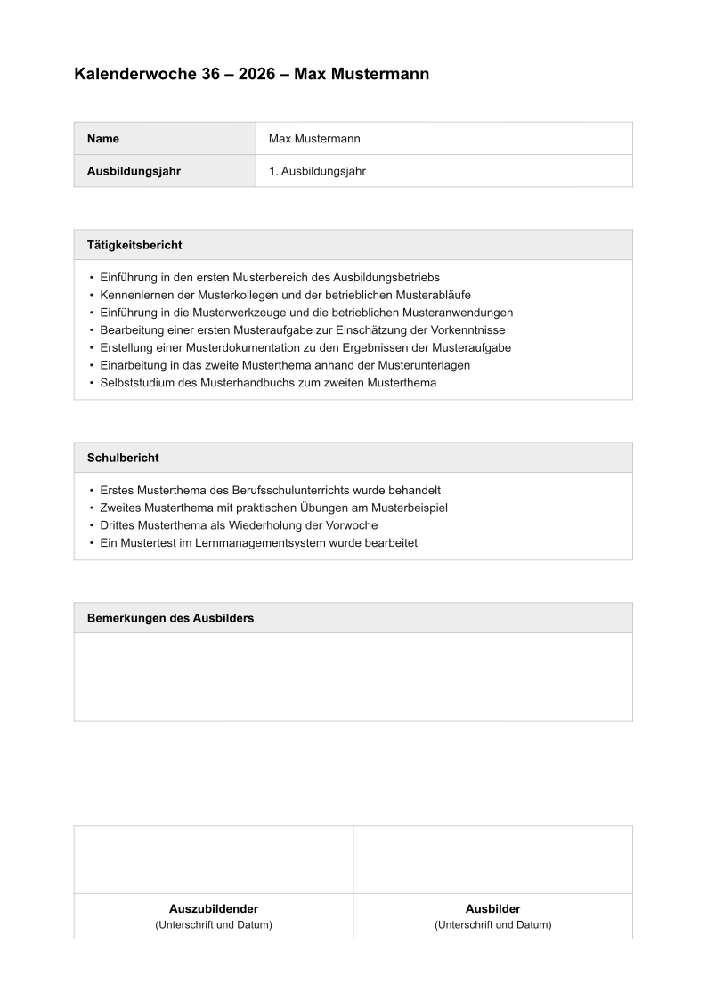
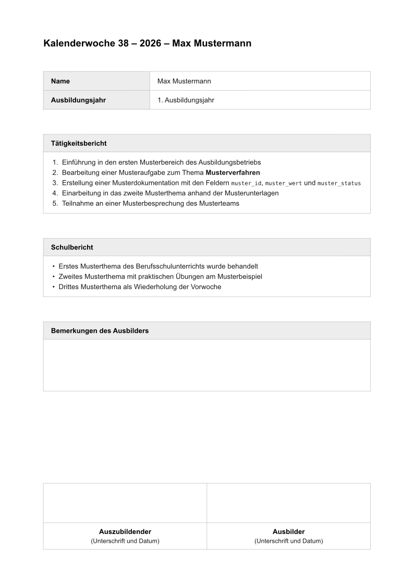
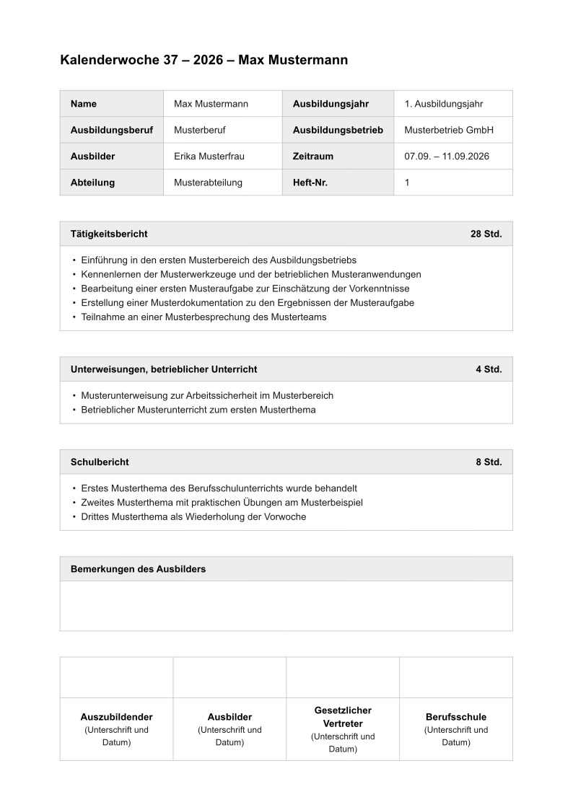
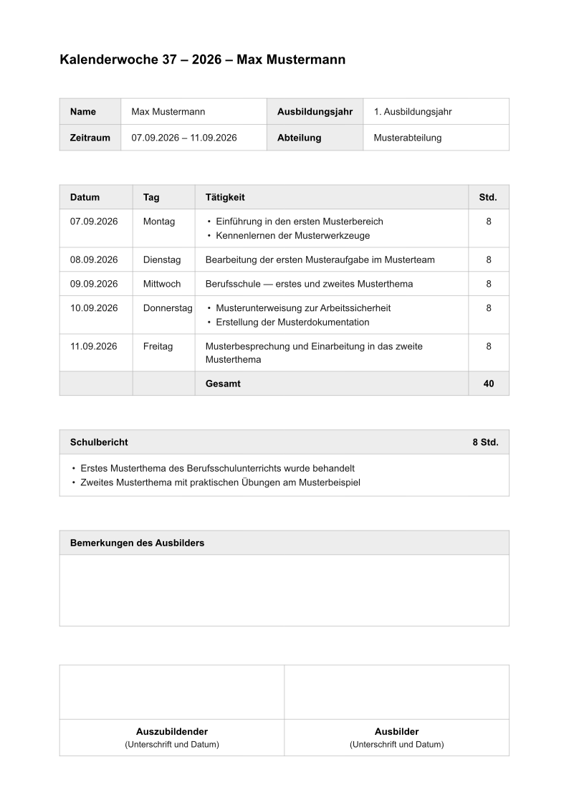
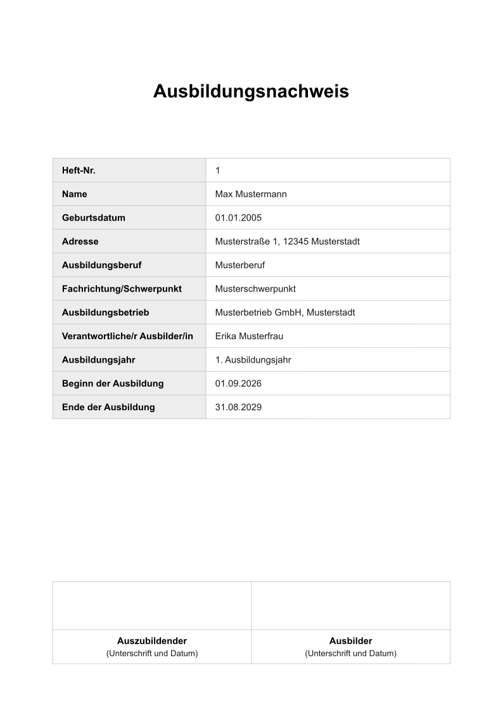
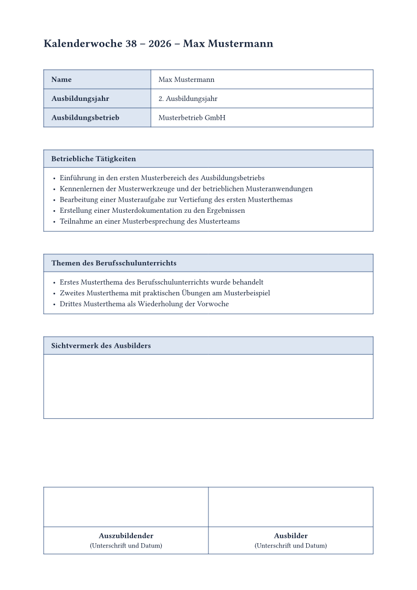

# azubinachweis

*Read in English: **[README.md](README.md)***

Ausbildungsnachweise für die deutsche Berufsausbildung — als Wochenbericht, als
Tagesbericht oder als Deckblatt, jeweils auf genau einer Seite.

Jede Kammer, jeder Betrieb und jede Berufsschule will das Berichtsheft ein
wenig anders: mit oder ohne Stundenangaben, mit einer Zeile pro Tag oder einer
Aufzählung pro Woche, mit zwei oder vier Unterschriftenfeldern, „Tätigkeits­
bericht" hier und „Betriebliche Tätigkeiten" dort. Statt einer festen Vorlage
gibt dieses Paket deshalb Bausteine: alle Felder sind optional und erscheinen
nur, wenn sie gefüllt sind, alle Beschriftungen sind überschreibbar, und
Schrift, Farben und Abstände liegen als Parameter offen. So lässt sich das
Heft an die eigene Vorgabe anpassen, ohne das Layout neu zu bauen — für jeden
Azubi, in jedem Beruf.

Die Abschnitte richten sich nach ihrem Inhalt: wo Text steht, ist die Box genau
so hoch wie der Text; wo nichts steht, bleibt eine Schreibfläche fester Höhe
für handschriftliche Einträge.

## Schnellstart

Ein Wochenbericht besteht aus zwei gleichrangigen Hälften — dem
Tätigkeitsbericht und dem Schulbericht —, also werden beide gleich
geschrieben. Entweder als Arrays von Strings:

```typ
#import "@preview/azubinachweis:0.1.1": nachweis

#nachweis(
  name: "Max Mustermann",
  ausbildungsjahr: "1. Ausbildungsjahr",
  kalenderwoche: "37",
  jahr: "2026",
  taetigkeiten: (
    "Einführung in den ersten Musterbereich des Ausbildungsbetriebs",
    "Bearbeitung einer Musteraufgabe zur Einschätzung der Vorkenntnisse",
    "Teilnahme an einer Musterbesprechung des Musterteams",
  ),
  schulbericht: (
    "Erstes Musterthema des Berufsschulunterrichts wurde behandelt",
    "Zweites Musterthema mit praktischen Übungen am Musterbeispiel",
  ),
)
```

oder als gewöhnliches Typst-Markup, ganz ohne Anführungszeichen:

```typ
#nachweis(
  name: "Max Mustermann",
  ausbildungsjahr: "1. Ausbildungsjahr",
  kalenderwoche: "37",
  jahr: "2026",
  taetigkeiten: [
    - Einführung in den ersten Musterbereich des Ausbildungsbetriebs
    - Bearbeitung einer Musteraufgabe zur Einschätzung der Vorkenntnisse
    - Teilnahme an einer Musterbesprechung des Musterteams
  ],
  schulbericht: [
    - Erstes Musterthema des Berufsschulunterrichts wurde behandelt
    - Zweites Musterthema mit praktischen Übungen am Musterbeispiel
  ],
)
```

Beides ergibt denselben Nachweis und wird identisch gesetzt: Einzug und
Abstände der Listen gibt das Paket vor, gleich welcher Schreibweise. Mischen
ist erlaubt — ein Abschnitt als Array, der nächste als Markup —, und Markup
erlaubt zusätzlich Nummerierung, Auszeichnungen, Links, Fußnoten und Code im
Berichtstext.

Jeder Abschnitt nimmt beide Formen: `unterweisungen`, `bemerkungen`,
`weiteres` und der `inhalt` eines Tages im `tagesbericht`.

### Kurzformen

Für dieselbe Sache gibt es zwei kürzere Schreibweisen. Inhaltsblöcke lassen
sich an den Aufruf anhängen — in der Reihenfolge, in der die Abschnitte im
Dokument stehen:

```typ
#nachweis(name: "Max Mustermann", kalenderwoche: "38", jahr: "2026")[
  + Erste Mustertätigkeit mit *Auszeichnung*
  + Zweite Mustertätigkeit
][
  - Erstes Musterthema
  - Zweites Musterthema
]
```

| Funktion | 1. Block | 2. Block | 3. Block |
| --- | --- | --- | --- |
| `nachweis` | Tätigkeitsbericht | Schulbericht | Bemerkungen |
| `tagesbericht` | Schulbericht | Bemerkungen | — |
| `deckblatt` | freier Zusatz | — | — |

Ein leerer Block `[]` überspringt einen Abschnitt, benannte Argumente bleiben
daneben gültig:

```typ
#nachweis(taetigkeiten: ("Aus einem Array",))[][
  - Dieser Schulbericht kommt aus dem zweiten Block
]
```

Und `#show: nachweis.with(..)` wirkt wie ein einzelner erster Block, macht den
Dokumenttext also zum Tätigkeitsbericht:

```typ
#show: nachweis.with(name: "Max Mustermann", kalenderwoche: "37", jahr: "2026")

- Einführung in den ersten Musterbereich des Ausbildungsbetriebs
- Bearbeitung einer Musteraufgabe zur Einschätzung der Vorkenntnisse
```

Das ist bequem, wenn eine Datei einen Nachweis enthält, behandelt aber die eine
Hälfte des Berichts anders als die andere. Wer beide Abschnitte benennt, wie im
Schnellstart, hält sie gleichrangig.

Das ist gleichzeitig der **minimale Aufbau**: Titelzeile, Name und
Ausbildungsjahr, Tätigkeitsbericht, Schulbericht, eine leere Fläche für
Bemerkungen und zwei Unterschriftenfelder. Mehr braucht es nicht — alles
Weitere (Stunden, Unterweisungen, Betrieb, Ausbilder, weitere
Unterschriften) erscheint erst, wenn es auch übergeben wird. Wer noch
weniger will, lässt `ausbildungsjahr` weg; wer die Kopftabelle ganz
loswerden will, lässt auch `name` weg und setzt die Titelzeile per `titel`.

## Was das Paket mitbringt

Die drei Dokumentfunktionen lassen sich per `#show: ….with(..)` oder direkt mit
Inhaltsblöcken aufrufen — beides ist gleichwertig.

| Export | Art | Zweck |
| --- | --- | --- |
| `nachweis` | Dokumentfunktion | Wochenbericht: Abschnitte mit Aufzählungen |
| `tagesbericht` | Dokumentfunktion | Tagesbericht: Tabelle mit einer Zeile pro Datum, Stundenspalte und Summe |
| `deckblatt` | Dokumentfunktion | Titelseite des Berichtshefts |
| `standard-bezeichnungen` | Dictionary | alle Beschriftungen als Vorgabe, einzeln überschreibbar |
| `standard-unterschriften` | Array | `("Auszubildender", "Ausbilder")` |

## Beispiele

Jedes Beispiel steht als Quelltext und als fertiges PDF im Ordner
[`examples/`](https://github.com/AyloRyd/azubinachweis/tree/v0.1.1/examples).

### Minimal

Das Grundlayout ohne jede Zusatzangabe: nur Name, Ausbildungsjahr, Woche und
Jahr, dazu die drei Abschnitte. Mehr braucht ein Wochenbericht nicht.

[`minimal.typ`](examples/minimal.typ) · [PDF](examples/minimal.pdf)



### Inhaltsblöcke

Dieselben vier Angaben, aber die Abschnitte als Inhaltsblöcke hinter dem
Aufruf — mit Nummerierung, Auszeichnungen und Code im Berichtstext.

[`content-blocks.typ`](examples/content-blocks.typ) · [PDF](examples/content-blocks.pdf)



### Wochenbericht mit allen Angaben

Alle Kopfzeilen, Stundenangaben je Abschnitt, der zusätzliche Abschnitt
„Unterweisungen" und vier Unterschriftenfelder. Der zweispaltige Kopf
(`kopfspalten: 2`) hält das alles auf einer Seite.

[`weekly-report.typ`](examples/weekly-report.typ) · [PDF](examples/weekly-report.pdf)



### Tagesbericht

Eine Tabellenzeile pro Datum, mit Wochentag, Stundenspalte und Summenzeile.

[`daily-report.typ`](examples/daily-report.typ) · [PDF](examples/daily-report.pdf)



### Deckblatt

Titelseite des Berichtshefts mit allen Stammdaten.

[`cover-sheet.typ`](examples/cover-sheet.typ) · [PDF](examples/cover-sheet.pdf)



### Eigenes Aussehen

Gleiche Struktur, andere Gestaltung: Serifenschrift, blaue Rahmen, farbige
Kopfzellen, größere Schreibflächen und eigene Beschriftungen.

[`custom-style.typ`](examples/custom-style.typ) · [PDF](examples/custom-style.pdf)



## `nachweis` — Wochenbericht

### Kopfdaten

Leere Felder erscheinen nicht in der Tabelle.

| Parameter | Bedeutung | Standard |
| --- | --- | --- |
| `name` | Name des Auszubildenden | `""` |
| `ausbildungsjahr` | z. B. `"1. Ausbildungsjahr"` | `""` |
| `kalenderwoche` | Nummer der Kalenderwoche | `""` |
| `jahr` | Jahr | `""` |
| `zeitraum` | z. B. `"07.09.2026 – 11.09.2026"` | `none` |
| `abteilung` | Ausbildungsbereich / Abteilung | `none` |
| `beruf` | Ausbildungsberuf | `none` |
| `fachrichtung` | Fachrichtung/Schwerpunkt | `none` |
| `betrieb` | Ausbildungsbetrieb | `none` |
| `ausbilder` | Verantwortliche/r Ausbilder/in | `none` |
| `heft-nr` | Heft-Nr. des Nachweises | `none` |

### Inhalt

| Parameter | Bedeutung | Standard |
| --- | --- | --- |
| `taetigkeiten` | Tätigkeitsbericht; auch als 1. Inhaltsblock oder Dokumenttext | `""` |
| `unterweisungen` | Abschnitt „Unterweisungen, betrieblicher Unterricht"; erscheint nur, wenn gefüllt | `none` |
| `schulbericht` | Themen des Berufsschulunterrichts | `""` |
| `bemerkungen` | Bemerkungen des Ausbilders; leer lassen für handschriftliche Notizen | `""` |
| `weiteres` | zusätzlicher Abschnitt am Ende; erscheint nur, wenn gefüllt | `none` |
| `stunden` | Stundenangaben je Abschnitt, z. B. `(betrieb: 28, unterweisung: 4, schule: 8)` | `(:)` |

Alle Inhaltsparameter nehmen drei Formen an:

```typ
schulbericht: "Es gab keinen Schulunterricht",        // ein Satz
schulbericht: ("Erster Punkt", "Zweiter Punkt"),      // Aufzählung
schulbericht: [Beliebiges #strong[Markup]],           // eigener Inhalt
```

Oder als Inhaltsblock hinter dem Aufruf — siehe [Kurzformen](#kurzformen).

### Aufbau und Beschriftung

| Parameter | Bedeutung | Standard |
| --- | --- | --- |
| `titel` | Titelzeile; `auto` setzt sie aus Woche, Jahr und Name zusammen | `auto` |
| `bezeichnungen` | überschreibt einzelne Beschriftungen, z. B. `(schule: "Berufsschule")` | `(:)` |
| `unterschriften` | Array der Unterschriftenfelder; `()` lässt sie weg | `("Auszubildender", "Ausbilder")` |
| `kopfspalten` | `1` = ein Feld je Zeile, `2` = zwei Felder je Zeile (halbe Kopfhöhe) | `1` |
| `kopfspalte` | Breite der Beschriftungsspalte. `auto` heißt einspaltig `5.4cm`, wächst aber mit langen eigenen Bezeichnungen mit; zweispaltig so schmal wie die Beschriftungen es zulassen | `auto` |
| `unterschrifthoehe` | Höhe der Unterschriftenfelder | `2cm` |

### Aussehen

| Parameter | Bedeutung | Standard |
| --- | --- | --- |
| `schrift` | Schriftfamilie(n) | `("Arial", "Helvetica", "Liberation Sans", "DejaVu Sans")` |
| `schriftgroesse` | Grundschriftgröße | `10pt` |
| `titelgroesse` | Größe der Titelzeile | `14pt` |
| `linie` | Rahmenfarbe | `#b5b5b5` |
| `kopfgrau` | Hintergrund der Kopfzellen | `#ededed` |
| `kopftext` | Schriftfarbe der Kopfzellen | `#000000` |
| `fliess` | Schriftfarbe des Fließtexts | `#1a1a1a` |
| `rahmen` | Rahmenstärke | `0.5pt` |
| `luft` | Abstand zwischen den Blöcken des Nachweises — der Satz fügt von sich aus keinen weiteren hinzu, es ist also genau dieser Abstand | `1.27cm` |
| `polster` | Innenabstand der Zellen | `11pt` |
| `mindesthoehe` | Höhe leerer Abschnitte (Schreibfläche) | `2cm` |
| `rand` | Seitenränder | `(x: 2.2cm, top: 2cm, bottom: 1.8cm)` |

### Anpassung

Ein Nachweis, der nur knapp zu hoch gerät, wird verkleinert statt auf zwei
Seiten umbrochen. Zuerst geben die Schreibflächen der leeren Abschnitte nach —
ein leeres Feld verträgt es am besten —, dann die Abstände zwischen den
Abschnitten, dann die Unterschriftenfelder, jeweils nur bis zur Untergrenze.

Solange der Nachweis ohnehin passt, wird nichts angetastet: ein von Hand
eingerichtetes Layout sieht genauso aus wie zuvor. Und wenn selbst die
Untergrenzen nicht reichen, darf der Nachweis auf eine zweite Seite — ein
Formular, in das sich nicht mehr schreiben lässt, ist schlechter als ein
zweites Blatt.

| Parameter | Bedeutung | Standard |
| --- | --- | --- |
| `anpassen` | verkleinert so weit nötig, um auf einer Seite zu bleiben | `true` |
| `luft-min` | Untergrenze für `luft` | `0.8cm` |
| `mindesthoehe-min` | Untergrenze für `mindesthoehe` | `1.2cm` |
| `unterschrifthoehe-min` | Untergrenze für `unterschrifthoehe` | `1.4cm` |

## `tagesbericht` — Tagesbericht

Kennt alle Parameter von `nachweis` (außer `unterweisungen`) und zusätzlich:

| Parameter | Bedeutung | Standard |
| --- | --- | --- |
| `tage` | Array der Tage, siehe unten | `()` |
| `summe` | Summenzeile unter der Stundenspalte | `true` |
| `spalten` | Spaltenbreiten `(datum: .., tag: .., stunden: ..)` | `(datum: 2.7cm, tag: 2.3cm, stunden: 1.5cm)` |
| `vorspann` | optionaler Text über der Tabelle | `none` |

Jeder Tag ist ein Dictionary. `tag` und `stunden` sind optional — fehlen sie
bei allen Tagen, entfällt die jeweilige Spalte.

```typ
tage: (
  (
    datum: "07.09.2026",
    tag: "Montag",
    inhalt: ("Erste Mustertätigkeit", "Zweite Mustertätigkeit"),
    stunden: 8,
  ),
  (datum: "08.09.2026", tag: "Dienstag", inhalt: "Eine Mustertätigkeit", stunden: 8),
)
```

## `deckblatt` — Titelseite

| Parameter | Bedeutung | Standard |
| --- | --- | --- |
| `heft-nr` | Heft-Nr. | `none` |
| `name` | Name | `""` |
| `geburtsdatum` | Geburtsdatum | `none` |
| `adresse` | Anschrift | `none` |
| `beruf` | Ausbildungsberuf | `none` |
| `fachrichtung` | Fachrichtung/Schwerpunkt | `none` |
| `betrieb` | Ausbildungsbetrieb | `none` |
| `ausbilder` | Verantwortliche/r Ausbilder/in | `none` |
| `ausbildungsjahr` | Ausbildungsjahr | `none` |
| `beginn`, `ende` | Beginn und Ende der Ausbildung | `none` |
| `unterschriften` | Unterschriftenfelder; leer = keine | `()` |
| `zusatz` | freier Zusatz unter der Tabelle; auch als Inhaltsblock | `none` |

Beschriftungen und Aussehen wie bei `nachweis`; `titelgroesse` ist hier `22pt`.

## Beschriftungen überschreiben

`standard-bezeichnungen` enthält alle Texte des Layouts. Einzelne Einträge
werden per `bezeichnungen` ersetzt:

```typ
#show: nachweis.with(
  bezeichnungen: (
    taetigkeiten: "Betriebliche Tätigkeiten",
    schule: "Themen des Berufsschulunterrichts",
    bemerkungen: "Sichtvermerk",
    stunden: "Stunden",
  ),
)
```

Schlüssel: `name`, `ausbildungsjahr`, `zeitraum`, `abteilung`, `beruf`,
`fachrichtung`, `betrieb`, `ausbilder`, `heft`, `adresse`, `geburtsdatum`,
`beginn`, `ende`, `taetigkeiten`, `unterweisungen`, `schule`, `bemerkungen`,
`weiteres`, `datum`, `tag`, `taetigkeit`, `stunden`, `summe`,
`unterschrift-zusatz`, `deckblatt-titel`.

## Schrift

Die Vorlage ist für eine humanistische Serifenlose ausgelegt und sucht in
dieser Reihenfolge: Arial, Helvetica, Liberation Sans, DejaVu Sans. Ist keine
davon vorhanden — etwa in der Web-App — greift Typst still auf Libertinus Serif
zurück; das Dokument bleibt korrekt, sieht aber anders aus. Schriften lassen
sich nicht mit einem Paket ausliefern, daher entweder eine der genannten
Familien installieren bzw. in das Web-App-Projekt hochladen, oder eine
vorhandene Familie wählen:

```typ
#show: nachweis.with(
  schrift: ("Inter", "Libertinus Serif"),
  // … die übrigen Argumente
)
```

## Mehrere Wochen verwalten

Eine Datei pro Woche (`kw36.typ`, `kw37.typ`, …), jede mit ihrem eigenen
`#show`-Aufruf. Einzeln bauen:

```sh
typst compile kw37.typ
```

Oder alle auf einmal:

```sh
for f in kw*.typ; do typst compile "$f"; done
```

## Wenn es nicht auf eine Seite passt

Meistens passt es inzwischen von selbst: der Nachweis verkleinert zuerst seine
eigenen Schreibflächen und Abstände, siehe [Anpassung](#anpassung). Was folgt,
gilt für die Fälle, in denen auch das nicht reicht — oder in denen Sie alles
selbst setzen möchten und `anpassen: false` gewählt haben.

In dieser Reihenfolge nachjustieren:

1. `kopfspalten: 2` — halbiert die Höhe der Kopfdatentabelle
2. `luft: 1cm` — engere Abstände zwischen den Abschnitten
3. `mindesthoehe: 1.5cm` und `unterschrifthoehe: 1.5cm` — kleinere Schreibflächen
4. `schriftgroesse: 9.5pt`

Niedrigere Untergrenzen — `mindesthoehe-min` und die beiden anderen —
verschaffen denselben Platz, ohne die übergebenen Werte anzutasten, und nur
dort, wo er wirklich gebraucht wird.

## Lizenz

MIT — siehe [LICENSE](LICENSE).
